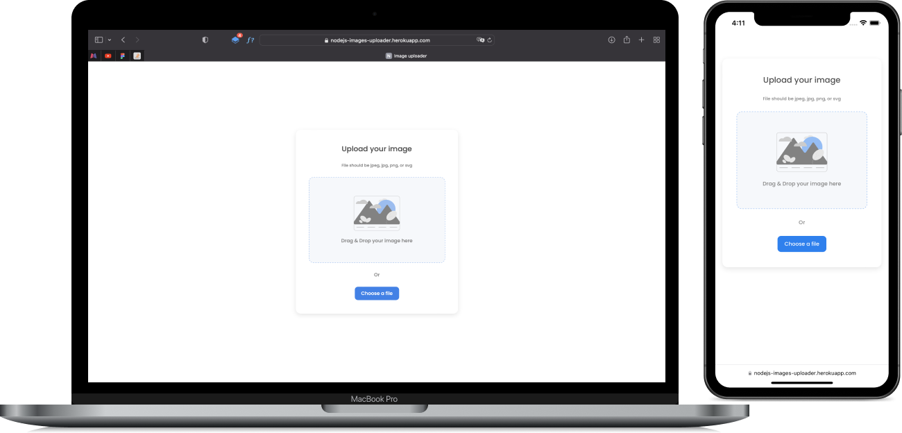

# Image uploader

With validation both in the browser and on the server, this project is carried out with `Express` and `Node.js`. The front-end, managed with native `JavaScript` and styled with `SASS` simulates an `SPA`, by managing everything without reloading.

# Features

You can send an image to the server, which returns the path to this image in `JSON`, which you can then copy by clicking on the `Copy` button. The image can be `draged & droped` or choosen directly from the device.

# Overview

The project is hosted by `Heroku`, et and you can test it by clicking on the link above, in the `Github` about section. With the hope that, some one will find something interesting in this repository, it was your unknown friend !😉

